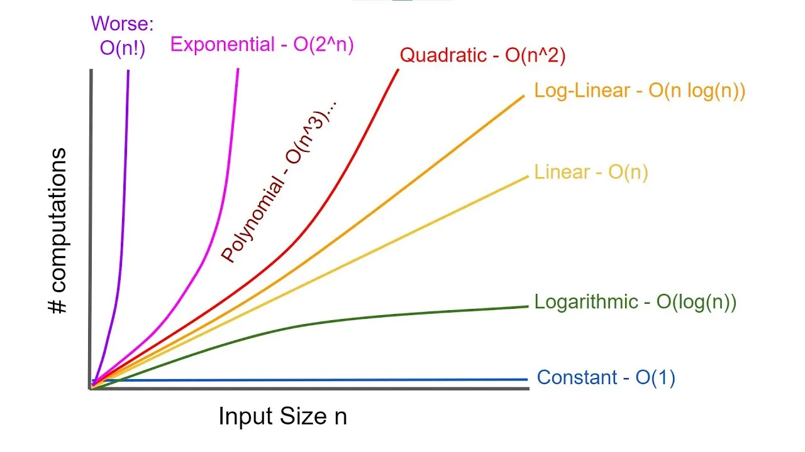

# 📘 Big O Notation

**Big O Notation** is a mathematical way to describe the **performance** or **complexity** of an algorithm. It tells you how the **time** or **space requirements** grow as the input size increases.

---

## 🔍 Purpose of Big O

- Evaluates **scalability** of algorithms.
- Describes the **upper bound** (worst-case) performance.
- Ignores constants and less significant terms.
- Useful for comparing algorithms independently of hardware.

---

## Complexities Graph



## 🚀 Common Time Complexities

| Big O        | Name              | Examples                              | Description                                  |
|--------------|-------------------|----------------------------------------|----------------------------------------------|
| **O(1)**     | Constant Time     | Accessing an array element             | Time doesn't grow with input size            |
| **O(log n)** | Logarithmic Time  | Binary search                          | Cuts problem size in half each step          |
| **O(n)**     | Linear Time       | Iterating through a list               | Time grows proportionally with input         |
| **O(n log n)**| Log-linear Time  | Merge Sort, Quick Sort (avg case)      | Common in efficient sorting algorithms       |
| **O(n²)**    | Quadratic Time    | Bubble sort, nested loops              | Performance degrades quickly as input grows  |
| **O(2ⁿ)**    | Exponential Time  | Recursive Fibonacci                    | Extremely costly; doubles each step          |
| **O(n!)**    | Factorial Time    | Solving permutations (e.g., TSP)       | Impractical for large inputs                 |

---

## 💾 Space Complexity

Big O also applies to **memory usage**:

- **O(1)** — Constant space (no extra storage).
- **O(n)** — Linear space (depends on input size).

---

## ⚠️ Why Ignore Constants?

Big O captures **asymptotic behavior**—how the algorithm behaves as input size (`n`) becomes very large.

For example:
- O(1000 * n) → O(n)
- O(n + log n) → O(n)

---

## 🧠 Code Examples

```python
# O(n): Linear time
def print_items(arr):
    for item in arr:
        print(item)

# O(n²): Quadratic time
def print_pairs(arr):
    for i in arr:
        for j in arr:
            print(i, j)

